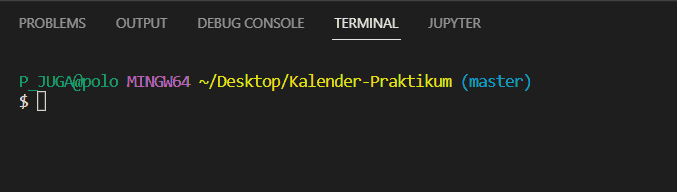
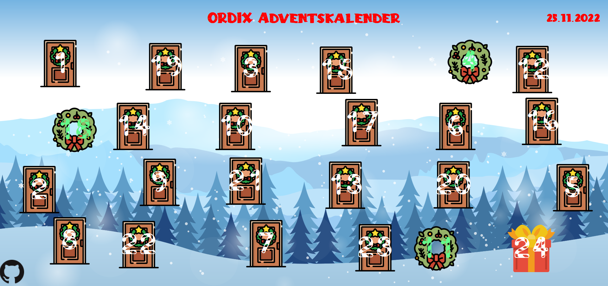
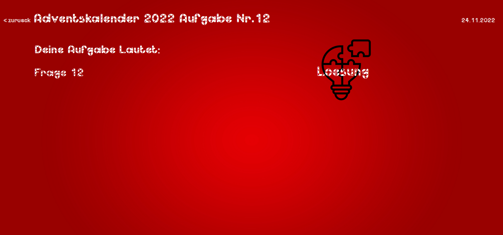
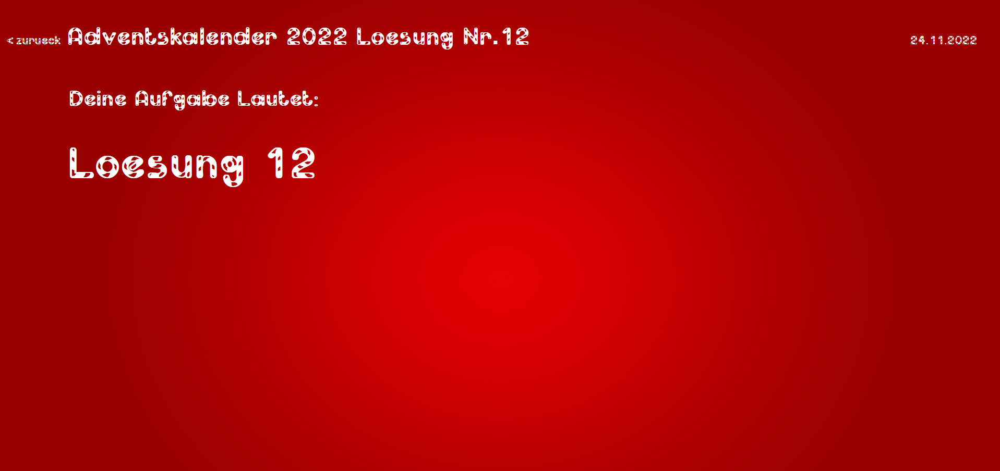

# Allgemeines
Im Rahmen meines Drewöchigen Schülerpraktikums bei der ORDIX AG hatte ich die Aufgabe einen Adventskalender mittels Python und dem Flask Framework zu erstellen. 

# Skritpaufruf
Um die Website im Localhost zu starten reicht ein 
```
python main.py
```
im terminal.



# Module


<body>
<table class="Table">
  <thead>
    <tr>
      <th>Modul</th>
      <th>Beschreibung</th>
      <th>Nutzen</th>
    </tr>
  </thead>
  <tbody>
    <tr>
      <td>Router</td>
      <td>Beinhaltet Webpage URL's</td>
      <td>Rendert die HTML Dateien und gibt Variablen weiter.<td>
    </tr>
    <tr>
      <td>Databasecontroller</td>
      <td>Verwaltet die Datenbank</td>
      <td>Um Text Antworte und Lösungen Auszulesen.</td>
    </tr>
    <tr>
      <td>Cookie</td>
      <td>Verwaltet Cookies</td>
      <td>Erstellt bei dem Besuch eines Türchen einen Cookie.</td>
    </tr>
    <tr>
      <td>Main</td>
      <td>Startet Flask</td>
      <td>Startet die Website und initialisiert die Datenbank.</td>   
    </tr>
  </tbody>
</table>
</body>

# Screenshots






